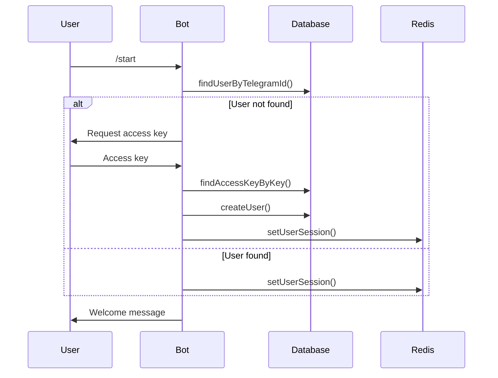
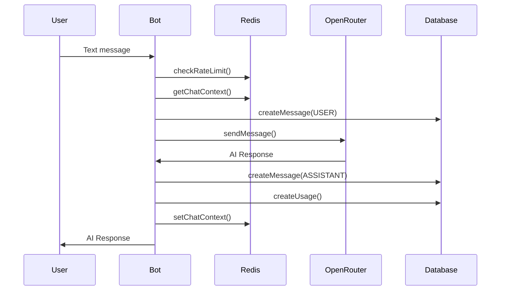
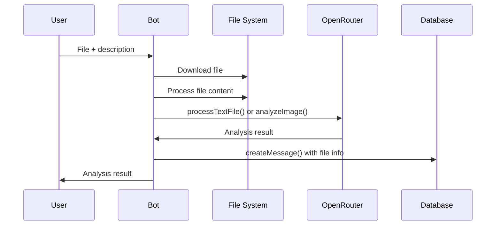

# Архитектура AI Chat Bot

## Обзор системы

AI Chat Bot - это масштабируемое приложение для Telegram, построенное на современном стеке технологий с микросервисной архитектурой.

## Технологический стек

### Backend
- **Node.js 18+** - среда выполнения JavaScript
- **TypeScript** - типизированный JavaScript для надежности кода
- **Telegraf** - фреймворк для Telegram ботов
- **Express.js** - веб-фреймворк для HTTP API
- **Prisma ORM** - современная ORM для работы с базой данных

### База данных
- **PostgreSQL 14+** - основная реляционная база данных
- **Redis 6+** - кэширование, сессии и rate limiting

### Внешние сервисы
- **OpenRouter API** - доступ к различным AI моделям
- **Telegram Bot API** - интеграция с Telegram

### DevOps
- **Docker & Docker Compose** - контейнеризация
- **Nginx** - reverse proxy и load balancer
- **Winston** - структурированное логирование

## Архитектурные принципы

### 1. Разделение ответственности
Каждый компонент системы имеет четко определенную ответственность:
- **Services** - бизнес-логика и интеграции
- **Handlers** - обработка команд Telegram
- **Middleware** - промежуточная обработка запросов
- **Utils** - вспомогательные функции

### 2. Слоистая архитектура
```
┌─────────────────────────────────────┐
│           Presentation Layer        │
│        (Telegram Handlers)          │
├─────────────────────────────────────┤
│           Business Layer            │
│         (Services & Logic)          │
├─────────────────────────────────────┤
│            Data Layer               │
│      (Database & External APIs)     │
└─────────────────────────────────────┘
```

### 3. Dependency Injection
Использование паттерна Singleton для сервисов с ленивой инициализацией.

### 4. Error Handling
Централизованная обработка ошибок с логированием и graceful degradation.

## Компоненты системы

### Core Services

#### DatabaseService
```typescript
class DatabaseService {
  // Singleton pattern
  private static instance: DatabaseService;
  
  // Методы для работы с пользователями
  static async createUser(data: UserData): Promise<User>
  static async findUserByTelegramId(id: bigint): Promise<User | null>
  
  // Методы для работы с сообщениями
  static async createMessage(data: MessageData): Promise<Message>
  static async getUserMessages(userId: string): Promise<Message[]>
  
  // Методы для аналитики
  static async getActiveUsersCount(): Promise<number>
  static async getTotalUsage(): Promise<UsageStats>
}
```

#### RedisService
```typescript
class RedisService {
  // Кэширование
  static async set(key: string, value: any, ttl?: number): Promise<void>
  static async get(key: string): Promise<any | null>
  
  // Сессии пользователей
  static async setUserSession(userId: string, data: any): Promise<void>
  static async getUserSession(userId: string): Promise<any | null>
  
  // Rate limiting
  static async checkRateLimit(userId: string): Promise<RateLimitResult>
  
  // Контекст чата
  static async setChatContext(userId: string, messages: any[]): Promise<void>
  static async getChatContext(userId: string): Promise<any[] | null>
}
```

#### OpenRouterService
```typescript
class OpenRouterService {
  // Отправка сообщений к AI
  static async sendMessage(
    messages: OpenRouterMessage[],
    options?: RequestOptions
  ): Promise<AIResponse>
  
  // Получение доступных моделей
  static async getModels(): Promise<Model[]>
  
  // Анализ изображений
  static async analyzeImage(
    imageUrl: string,
    prompt: string
  ): Promise<AIResponse>
  
  // Обработка файлов
  static async processTextFile(
    content: string,
    prompt: string
  ): Promise<AIResponse>
}
```

### Bot Architecture

#### Middleware Pipeline
```
Request → Logging → Error Handler → Rate Limit → Auth → Handler → Response
```

1. **Logging Middleware** - логирование всех запросов
2. **Error Handler** - обработка ошибок
3. **Rate Limit Middleware** - защита от спама
4. **Auth Middleware** - проверка доступа
5. **Command Handlers** - обработка команд

#### Handler Structure
```typescript
interface BotContext extends Context {
  session: {
    user?: User;
    awaitingAccessKey?: boolean;
  };
}

type Handler = (ctx: BotContext) => Promise<void>;
```

### Data Models

#### User Model
```typescript
interface User {
  id: string;
  telegramId: bigint;
  username?: string;
  firstName?: string;
  lastName?: string;
  accessKeyId: string;
  isAdmin: boolean;
  isActive: boolean;
  createdAt: Date;
  updatedAt: Date;
}
```

#### Message Model
```typescript
interface Message {
  id: string;
  userId: string;
  content: string;
  role: 'USER' | 'ASSISTANT' | 'SYSTEM';
  tokens?: number;
  cost?: number;
  fileUrl?: string;
  fileName?: string;
  fileType?: string;
  messageId?: number;
  createdAt: Date;
}
```

#### Access Key Model
```typescript
interface AccessKey {
  id: string;
  key: string;
  isActive: boolean;
  createdBy: string;
  usedAt?: Date;
  createdAt: Date;
  updatedAt: Date;
}
```

## Потоки данных

### 1. Аутентификация пользователя


### 2. Обработка сообщения


### 3. Обработка файла


## Безопасность

### 1. Аутентификация и авторизация
- **Access Keys** - уникальные ключи для доступа к боту
- **Session Management** - сессии пользователей в Redis
- **Admin Rights** - отдельные права для администраторов

### 2. Rate Limiting
- **Per-user limits** - ограничения на пользователя
- **Sliding window** - скользящее окно для подсчета запросов
- **Redis-based** - хранение счетчиков в Redis

### 3. Input Validation
- **File type validation** - проверка типов файлов
- **File size limits** - ограничения размера файлов
- **Content sanitization** - очистка пользовательского ввода

### 4. Error Handling
- **Graceful degradation** - корректная обработка ошибок
- **No sensitive data exposure** - скрытие чувствительной информации
- **Structured logging** - детальное логирование для отладки

## Масштабирование

### Горизонтальное масштабирование
1. **Stateless Application** - приложение не хранит состояние
2. **Redis for Sessions** - внешнее хранение сессий
3. **Database Connection Pooling** - пул соединений с БД
4. **Load Balancer** - распределение нагрузки через Nginx

### Вертикальное масштабирование
1. **Resource Optimization** - оптимизация использования ресурсов
2. **Database Indexing** - индексы для быстрых запросов
3. **Caching Strategy** - кэширование часто используемых данных
4. **Connection Limits** - ограничения соединений

### Мониторинг и метрики
1. **Health Checks** - проверки состояния сервисов
2. **Application Metrics** - метрики приложения
3. **Database Monitoring** - мониторинг базы данных
4. **Log Aggregation** - агрегация логов

## Развертывание

### Development Environment
```bash
# Локальная разработка
npm run dev

# База данных
docker-compose up postgres redis
```

### Production Environment
```bash
# Docker Compose
docker-compose -f docker-compose.prod.yml up -d

# Или через скрипт деплоя
./scripts/deploy.sh production
```

### CI/CD Pipeline
1. **Code Quality** - ESLint, Prettier, TypeScript проверки
2. **Testing** - автоматические тесты
3. **Build** - сборка Docker образов
4. **Deploy** - автоматический деплой
5. **Health Check** - проверка работоспособности

## Резервное копирование

### Стратегия бэкапов
1. **Database Backups** - ежедневные дампы PostgreSQL
2. **File Backups** - резервные копии загруженных файлов
3. **Redis Snapshots** - снапшоты Redis данных
4. **Configuration Backups** - резервные копии конфигураций

### Восстановление
1. **Point-in-time Recovery** - восстановление на определенный момент
2. **Incremental Backups** - инкрементальные бэкапы
3. **Disaster Recovery** - план восстановления после сбоев

## Производительность

### Оптимизации
1. **Database Queries** - оптимизированные запросы к БД
2. **Connection Pooling** - пулы соединений
3. **Caching** - многоуровневое кэширование
4. **Async Processing** - асинхронная обработка

### Метрики производительности
- **Response Time** - время ответа
- **Throughput** - пропускная способность
- **Error Rate** - частота ошибок
- **Resource Usage** - использование ресурсов

## Заключение

Архитектура AI Chat Bot спроектирована с учетом современных принципов разработки:
- **Модульность** - четкое разделение компонентов
- **Масштабируемость** - возможность горизонтального и вертикального масштабирования
- **Надежность** - обработка ошибок и восстановление
- **Безопасность** - защита данных и контроль доступа
- **Производительность** - оптимизация для высоких нагрузок

Эта архитектура обеспечивает стабильную работу бота и возможность его развития в будущем.
